# PolySync

**Stay in Sync.**

PolySync is an AI-powered Chrome extension that extracts events' information from your screen and turns them into structured, calendar-ready entries in seconds.

Built for the **Poly Prompt Hackathon 2026** under the **College Life** category.

---

## Overview

College students frequently discover events through Instagram posts, digital flyers, emails, and websites. However, converting that unstructured visual content into usable calendar events requires manual typing — leading to forgotten details and missed opportunities.

PolySync eliminates this friction.

With one click, users can capture a screenshot of any browser tab. AI instantly detects an event and extracts structured event details. What was once a static screenshot becomes clean, editable, and calendar-ready data in seconds.

---

## The Problem

Students:
- Discover events through screenshots and social media
- Delay adding events to their calendar, and eventually forget to keep track of them
- Make mistakes entering key details (time, location, registration links)
- Miss opportunities due to manual entry friction

Manual data entry discourages organization and leads to missed campus experiences.

---

## The Solution

PolySync introduces a seamless workflow:

1. Click **“Capture Event”**
2. Capture the current browser tab
3. AI detects an event & extracts structured event details
4. Review and edit extracted information
5. Save locally, export as an ICS file or save online via Google log-in
6. Easily sync to your Google calendar

From screenshot to structured plan — in under 10 seconds.

---

## How AI Powers PolySync

PolySync uses OpenAI’s **Responses API with vision capabilities** to:

- Analyze browser screenshots
- Detect whether an event is present
- Extract structured event fields in strict JSON format:
  - Title  
  - Date & Time  
  - Location  
  - Host  
  - Registration Link  
  - Cost  

This structured extraction ensures clean, consistent, calendar-ready output from unstructured visual content.

### AI in Development

AI was also used throughout the build process to:

- Interpret PRD and MVP requirements
- Structure the Chrome Extension under Manifest V3
- Design strict structured prompts
- Implement event storage logic
- Generate ICS export functionality

Human oversight was required for UI state handling and button logic, reinforcing responsible and thoughtful AI usage.

---

## Demo Story

Our demo follows a college student named Alex:

- She discovers a campus event on social media.
- Instead of manually typing details, she uses PolySync.
- Within seconds, event data is extracted automatically.
- She reviews and edits minor details if needed.
- The event is added and appears on her dashboard.
- She adds a friend and syncs it to her calendar.
- Finally, she deletes the event and signs out — demonstrating full user control.

**Our Magic Moment:** Turning a screenshot into a structured, actionable event instantly.

---

## Technical Stack

- Chrome Extension (Manifest V3)
- Chrome API
- HTML
- CSS
- JavaScript
- React.js
- Next.js
- OpenAI Responses API (Vision using gpt4o-mini)
- Google OAuth
- Supabase for event storage
- Supabase.js
- Structured JSON extraction
- Local event storage
- ICS file export
- Light/Dark mode UI 

---

## Architecture Diagram

## Ethics & Responsible Use

- Users must actively trigger screenshot capture, which avoids sensitive information being monitored by AI
- Extracted data is reviewable and editable before & after saving.
- Users can delete events at any time.
- No hidden scraping or background monitoring occurs.
- The tool extracts only visible content and does not fabricate events.

We prioritize transparency, user agency, and responsible AI deployment.

---

## Links

- Website: https://polysync.dev  
- Demo Video: https://drive.google.com/file/d/1xc23FR5QGmBhK-4OJII7eaFdJeAZHSUv/view?usp=sharing

---

## Team — Jason’s Jesters

- **Tech Lead:** *Curren Sebastian*  
- **Product Lead:** *Omar Mohamed*, *Ammara Amin*
- **Ethics Lead:** *Kylie Chao*, *Marine Hunanyan*  

Built for OpenAI Poly Prompt 2026 Hackathon.

---

We focused on depth over breadth and built one clear, impactful experience for students:

**Capture → Extract → Sync.**

Stay in Sync.
